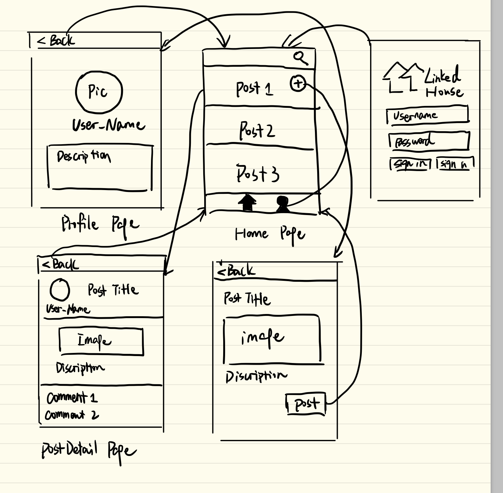

Group Project - README Template
===

# LinkedHouse

## Table of Contents
1. [Overview](#Overview)
1. [Product Spec](#Product-Spec)
1. [Wireframes](#Wireframes)
2. [Schema](#Schema)

## Overview
### Description
An iOS app which allows UCSD students to share and read posts about renting apartments and finding roommates.
### App Evaluation
[Evaluation of your app across the following attributes]
- Category: Lifestyle
- Mobile: This app would be primarily developed for mobile.
- Story: Allow users share and read posts about renting apartments and finding roommates
- Market: College students looking for a roommate or an off-campus apartment
- Habit: Users can develop the habbit of using this app whenever they want to find a new roommate or rent a new apartment, instead of using facebook or other social media apps.
- Scope: This app will target at UCSD students for now. In the future, it may be expanded to more campuses.

## Product Spec

### 1. User Stories (Required and Optional)

**Required Must-have Stories**

* Log in and log out
* Make a post
* Provide a title for the post
* Provide a description for the post
* Include a picture in the post
* View comments on a post
* Add a new comment
* Allow pull to refresh

**Optional Nice-to-have Stories**

* Use keywords to search for the post
* User can add a profile picture
* User can view their profile in a profile tab
* Profile pictures are shown for posts and comments
* Load past posts infinitely
* Stay logged in across restarts

### 2. Screen Archetypes
* Login
   * User signs up or logs into their account
* Home screen 
   * User can scroll and see the posts.
   * User can search for a post using a keyword.
   * User can navigate to MakePost screen to make a post.
   * User can navigate to Post screen to look at the details of a certain post.
   * User can pull to refresh the feeds.
* MakePost screen 
   * User can provide a title for the item.
   * User can provide an image for the item.
   * User can provide a description for the item.
   * User can post the information to the feeds.
   * User can navigate back to Home screen.
* PostDetail Screen
   * User can see the detailed information.
   * User can see the image.
   * User can navigate back to Home screen.
* Profile Screen
   * User can upload a profile picture and fill in information that is interesting to them and others

### 3. Navigation

**Tab Navigation** (Tab to Screen)

* PostDetail
* Profile

**Flow Navigation** (Screen to Screen)

* Login Screen
   * Home Screen
* Home Screen
   * Profile Screen
   * MakePost Screen 
   * PostDetail Screen
* Profile Screen
   * Home Screen
* PostDetail Screen
   * Home Screen
* MakePost Screen
   * Home Screen 
  

## Wireframes

### [BONUS] Digital Wireframes & Mockups

### [BONUS] Interactive Prototype

## Schema 
[This section will be completed in Unit 9]
### Models
Post
|Property|Type|Description|
|---|---|---|
|Title|String|The title of the post, users should define if they are looking for a house or roommate|
|Description|String|Description of the house or roommate|
|Image|File|Image of the house or roommate|
|Date|DateTime|The date of the post being posted|
|Author|Pointer to User|The original poster of the post|
|Comment|String|Comments to the post made by other users|

User
|Property|Type|Description|
|---|---|---|
|User-name|String|Account user name|
|Password|String|Account password|
|Userid|Number|an unique id to represent an user|
|Profile picture|File|Profile picture of the user|
|Description|String|Description of the house or the roommate|

### Networking
- [Add list of network requests by screen ]
- [Create basic snippets for each Parse network request]
- [OPTIONAL: List endpoints if using existing API such as Yelp]
